# OpenSprinklerPro kiterjesztések

Az OpenSprinklerPro egy kibővített funkciókészlet az OpenSprinkler öntözésvezérlőkhöz, amelyek modern rádiós integrációkat, fejlettebb érzékelőket, online frissítéseket, valamint AI/MCP hozzáférést és komplex eszköz-felügyeletet igényelnek. Az alapvető OpenSprinkler funkciókra épül: zónák, programok, időjáráshoz való igazítás (Weather Adjustment), naplózás és távoli elérés az applikáción/böngészőn keresztül.

Az OpenSprinklerShop saját szoftverága (Firmware), amely tartalmazza az OpenSprinklerPro kiterjesztéseket is, az upstream verzióktól független verziószámozást használ. A jelenlegi OpenSprinklerShop firmware verzió: **2.4.0(219)**.

## Áttekintés

Az OpenSprinklerPro a következő területeken kínál kiegészítő funkciókat:

- **Online OTA frissítés** állapotjelzéssel, verzióellenőrzéssel és automatikus biztonsági mentési végpontokkal.
- **ESP32-C5 rádiós funkciók**: Beépített Zigbee átjáró (Gateway) / kliens támogatás és IEEE 802.15.4 üzemmódváltás.
- **Bluetooth (BLE) érzékelők** támogatott ESP32 és Bluetooth-al rendelkező OSPi rendszereken.
- **FYTA felhő alapú növényi érzékelők** integrációja (talajnedvesség és hőmérséklet méréséhez).
- **Matter és ESP RainMaker** integráció az okosotthonos eszközkapcsolatokhoz.
- **MCP interfész** mesterséges intelligencia (AI) asszisztensek számára (közvetlenül a firmware-en vagy külső Node.js MCP szerveren).
- **Értesítési események** (MQTT, e-mail, IFTTT és fejlettebb automatizálások).

## Platform elérhetőség

| Funkció | ESP32-C5 Zigbee | ESP32-C5 Matter | ESP32 / non-C5 | ESP8266 | OSPi |
|---|:---:|:---:|:---:|:---:|:---:|
| Alap öntözési funkciók, programok, web UI | ✅ | ✅ | ✅ | ✅ | ✅ |
| Online OTA (Web UI frissítés) | ✅ | ✅ | ✅ | ✅ | ❌ |
| Script/Git alapú frissítés | ❌ | ❌ | ❌ | ❌ | ✅ |
| HTTPS / ACME tanúsítványok | ✅ | ✅ | ESP32-függő | ❌ | ❌ |
| Zigbee / IEEE 802.15.4 | ✅ | ❌ | ❌ | ❌ | ❌ |
| BLE (Bluetooth) érzékelők | ✅ | ✅ | funkcióflag-függő | ❌ | ✅ Linux BT-n át |
| Matter végpont | ❌ | ✅ | funkcióflag-függő | ❌ | ❌ |
| ESP RainMaker | ✅ | ✅ | ESP32-függő | ❌ | ❌ |
| FYTA érzékelők | ✅ HTTPS | ✅ HTTPS | ✅ HTTPS | ✅ Csak HTTP | ✅ HTTPS |
| Beépített firmware MCP `/mcp` | ✅ ESP32 + `USE_OTF` | ✅ ESP32 + `USE_OTF` | ✅ ESP32 + `USE_OTF` | ❌ | ❌ |
| Külső Node.js MCP szerver | ✅ | ✅ | ✅ | ✅ | ✅ |

Megjegyzések:
- Az ESP32-C5 Zigbee és Matter változatok különálló firmware-ek. A Zigbee és a Matter rádiócsatornák nem futhatnak egyidejűleg ugyanazon az ESP32-C5 chipen.
- A Zigbee végpontokhoz ESP32-C5 és `OS_ENABLE_ZIGBEE` opció szükséges.
- A BLE végpontokhoz ESP32 és `OS_ENABLE_BLE` szükséges; az ESP8266 nem támogatja a BLE-t.

Lásd még: [API kiegészítések](pro-api-endpoints-hu.md) (opcionális), [CHANGELOG](CHANGELOG.md).

## Felhasználói felület (UI) és mobil képernyőfotók

Az OpenSprinklerPro kiterjesztéseit a normál webes/appos felhasználói felületről vezérelheti. A REST API végpontok elsősorban integrációkra és diagnosztikára szolgálnak; a felhasználói beállítások az alábbi menükből érhetők el.

| Kiterjesztés | Funkció / Menü elérési út | Képernyőkép |
|---|---|---|
| Online firmware frissítés | Oldalsó menü → **Online Update** | 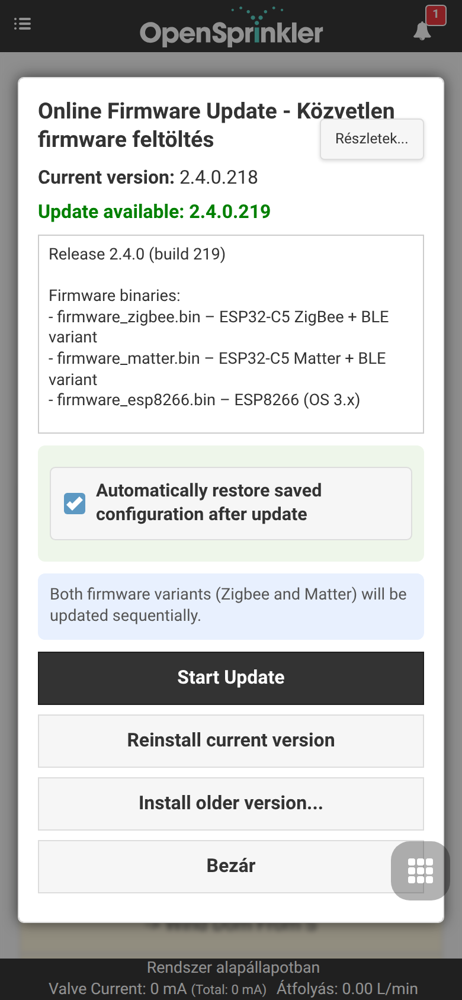{ .mobile-screenshot } |
| ESP32-C5 rádiómód / Matter választás | Oldalsó menü → **Setup ESP32 Mode** | { .mobile-screenshot } |
| Zigbee átjáró (Gateway) | Oldalsó menü → **ZigBee Gateway** | 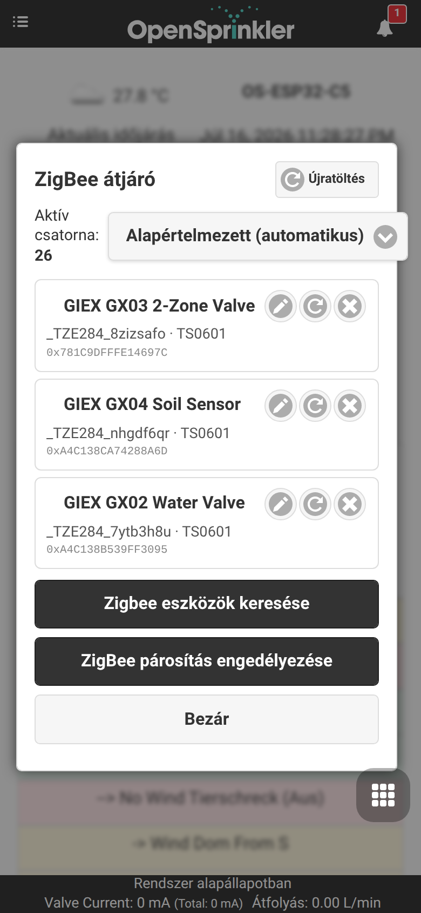{ .mobile-screenshot } |
| ESP RainMaker | Oldalsó menü → **RainMaker** | 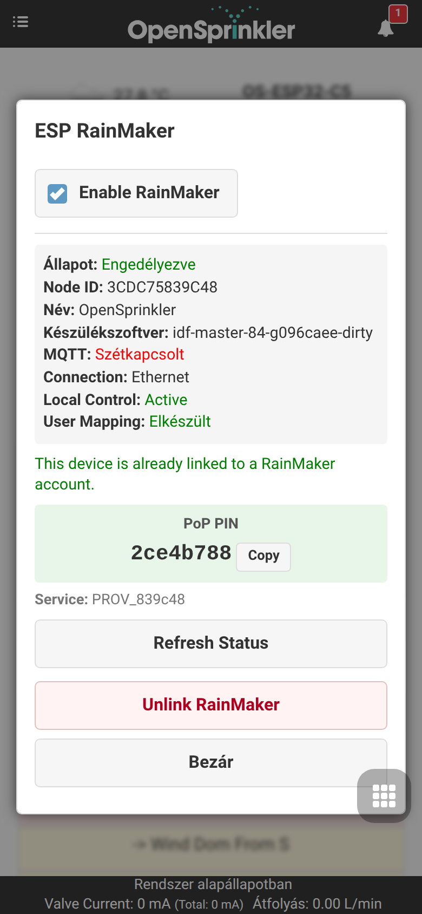{ .mobile-screenshot } |
| MQTT, e-mail, IFTTT és értesítések | Alsó menü → **Edit Options** → **Integrations** | 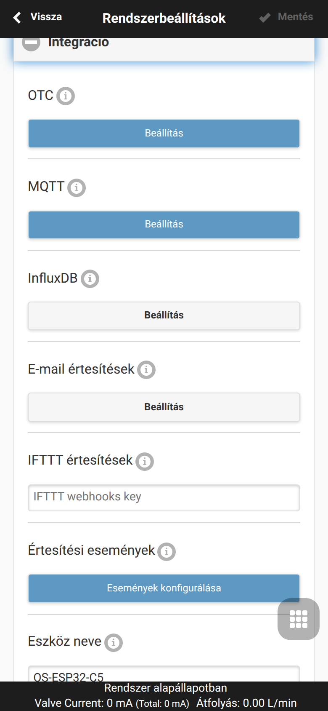{ .mobile-screenshot } |
| Érzékelők, FYTA és monitorok | Alsó menü → **Analog Sensor Configuration** | { .mobile-screenshot } |
| Új érzékelő hozzáadása/szerkesztése | Alsó menü → **Analog Sensor Configuration** → **Add Sensor** | 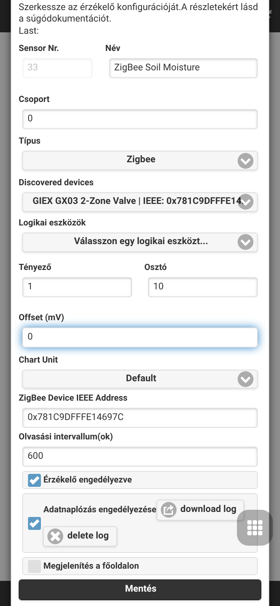{ .mobile-screenshot } |
| Program korrekciók | Alsó menü → **Analog Sensor Configuration** → **Program Adjustments** | { .mobile-screenshot } |
| Új program korrekció | Alsó menü → **Analog Sensor Configuration** → **Program Adjustments** → **Add program adjustment** | 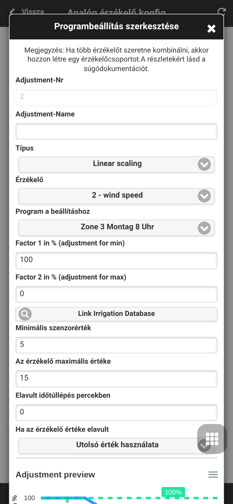{ .mobile-screenshot } |
| Helyi monitorozás szabályai | Alsó menü → **Analog Sensor Configuration** → **Monitoring and Control** | { .mobile-screenshot } |
| Új monitor hozzáadása | Alsó menü → **Analog Sensor Configuration** → **Monitoring and Control** → **Add monitor** | 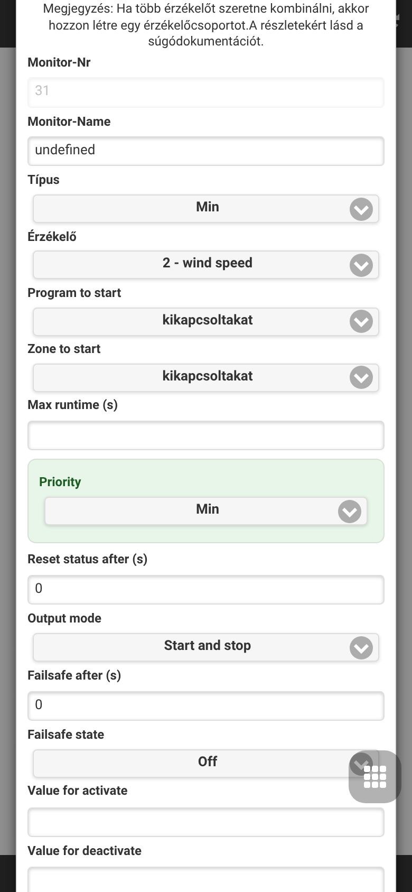{ .mobile-screenshot } |
| Érzékelő grafikontábla | Alsó menü → **Analog Sensor Configuration** → **Sensor Chart** | 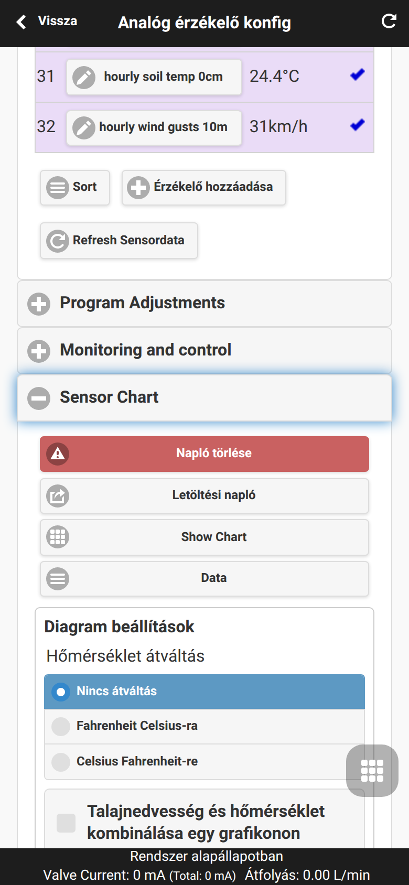{ .mobile-screenshot } |
| FYTA konfiguráció | Alsó menü → **Analog Sensor Configuration** → **FYTA Setup** | 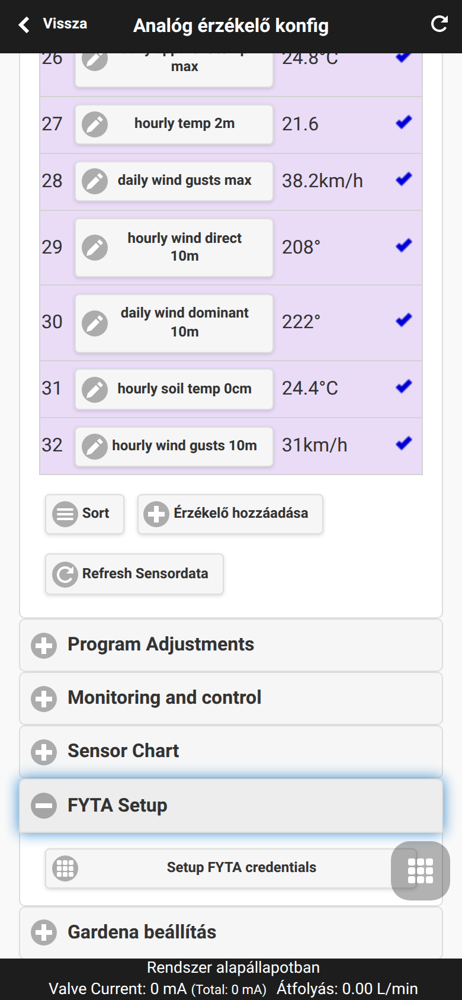{ .mobile-screenshot } |
| FYTA fiók adatok | Alsó menü → **Analog Sensor Configuration** → **FYTA Setup** → **Setup FYTA credentials** | 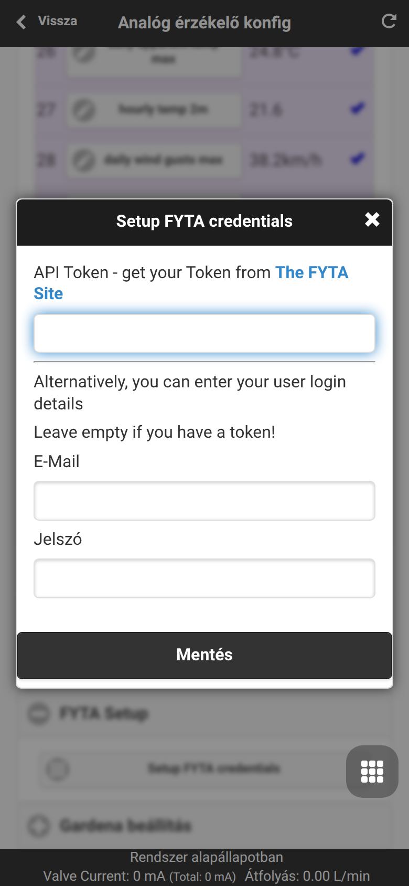{ .mobile-screenshot } |
| Biztonsági mentés és visszaállítás | Alsó menü → **Analog Sensor Configuration** → **Backup and Restore** | 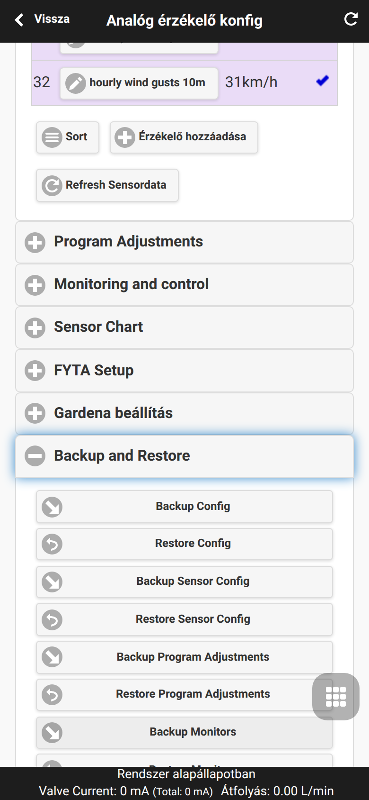{ .mobile-screenshot } |
| Rendszerdiagnosztika | Oldalsó menü → **System Diagnostics** | 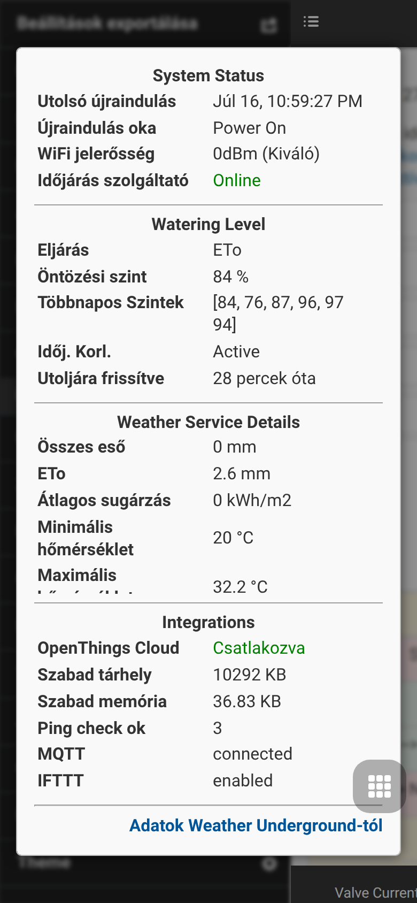{ .mobile-screenshot }|

## Online OTA szoftverfrissítés (Update)

A Pro firmware tartalmazza az integrált online frissítéskezelést (`online_update.cpp`). A vezérlő lekéri az elérhető szoftverváltozatok listáját az internetről, elvégzi a biztonsági mentést, konfigurálja a frissítést és mindezt valós időben közvetíti a felületen.

**UI használata:** Nyissa meg az oldalsó menüt, majd válassza az **Online Update** menüpontot. Ez az ajánlott eljárás a frissítésre, mivel biztonsági mentést is készít a szoftver letöltése és flashelése előtt.

{ .mobile-screenshot }

Megjegyzések:
- **ESP32 és ESP8266:** Az OTA frissítés a web UI-n és manuális bináris fájl-feltöltésen keresztül is elérhető.
- **OSPi:** A frissítés terminal/Git/script segítségével történik, nem az OTA felületen.
- Az online frissítés működéséhez aktív internetkapcsolat szükséges.

Frissítés előtt mindenképpen készítsen biztonsági mentést. Az API automatikus hívásokat is támogat: `/uc` az ellenőrzéshez, `/uu` a frissítés indításához, `/us` az állapot lekéréséhez, és `/ub` a teljes biztonsági mentés elkészítéséhez.
