# Rozszerzenia OpenSprinklerPro

OpenSprinklerPro to rozszerzony zestaw funkcji dla sterowników OpenSprinkler, zaprojektowany dla instalacji wymagających nowoczesnej integracji radiowej, zaawansowanych czujników, aktualizacji online, dostępu do asystentów AI (poprzez protokół MCP) oraz kompleksowego monitorowania urządzeń. Rozszerzenie bazuje na standardowych funkcjach nawadniania: sekcjach (strefach), harmonogramach (programach), korektach pogodowych, historii pracy i zdalnym dostępie (przeglądarka / aplikacja mobilna).

Oprogramowanie OpenSprinklerShop (w tym rozszerzenia OpenSprinklerPro) posiada własną, niezależną numerację wersji firmware od głównej gałęzi (upstream). Obecna stabilna wersja firmware OpenSprinklerShop to **2.4.0(208)**.

## Przegląd funkcji

OpenSprinklerPro dodaje kluczowe rozszerzenia w następujących obszarach:

- **Aktualizacje online OTA** z monitorowaniem postępu, sprawdzaniem zgodności plików manifestu i automatyczną kopią zapasową ustawień.
- **Funkcje radiowe ESP32-C5**: Bramka (Gateway) / klient Zigbee oraz zaawansowane przełączanie trybów IEEE 802.15.4.
- **Bezprzewodowe czujniki BLE (Bluetooth)** na obsługiwanych mikrokontrolerach ESP32 oraz platformach OSPi.
- **Mobilne czujniki rolnicze/ogrodowe FYTA** z integracją w chmurze (pomiary wilgotności gleby i temperatury).
- **Protokół Matter i ESP RainMaker** dla bezproblemowej integracji z nowoczesnymi systemami inteligentnego domu.
- **Interfejs MCP** dla łatwego użytkowania modelu AI (bezpośrednio w oprogramowaniu układowym lub poprzez zewnętrzny serwer Node.js).
- **Powiadomienia i zdarzenia push**: Integracje z MQTT, e-mail oraz IFTTT.

## Dostępność na platformach sprzętowych

| Funkcja | ESP32-C5 Zigbee | ESP32-C5 Matter | ESP32 / non-C5 | ESP8266 | OSPi |
|---|:---:|:---:|:---:|:---:|:---:|
| Nawadnianie, programy, interfejs Web, logi | ✅ | ✅ | ✅ | ✅ | ✅ |
| Online OTA (Aktualizacja przez interface Web) | ✅ | ✅ | ✅ | ✅ | ❌ |
| Aktualizacja przez terminal/Git | ❌ | ❌ | ❌ | ❌ | ✅ |
| Certyfikaty HTTPS / ACME | ✅ | ✅ | Zależnie od ESP32 | ❌ | ❌ |
| Protokół Zigbee / IEEE 802.15.4 | ✅ | ❌ | ❌ | ❌ | ❌ |
| Czujniki BLE (Bluetooth) | ✅ | ✅ | Zależnie od flag kompilacji | ❌ | ✅ Przez Linux BT |
| Standard Matter | ❌ | ✅ | Zależnie od ESP32 | ❌ | ❌ |
| Integracja ESP RainMaker | ✅ | ✅ | Zależnie od ESP32 | ❌ | ❌ |
| Czujniki FYTA | ✅ HTTPS | ✅ HTTPS | ✅ HTTPS | ✅ Tylko HTTP | ✅ HTTPS |
| Wbudowany firmware MCP `/mcp` | ✅ ESP32 + `USE_OTF` | ✅ ESP32 + `USE_OTF` | ✅ ESP32 + `USE_OTF` | ❌ | ❌ |
| Zewnętrzny serwer Node.js MCP | ✅ | ✅ | ✅ | ✅ | ✅ |

Uwagi:
- Warianty ESP32-C5 Zigbee oraz Matter to dwa różne pliki oprogramowania układowego (firmware). Zigbee i Matter nie mogą działać równolegle na tym samym układzie radiowym ESP32-C5.
- Obsługa Zigbee wymaga kontrolera ESP32-C5 oraz włączonej flagi `OS_ENABLE_ZIGBEE`.
- Czujniki BLE wymagają ESP32 oraz flagi `OS_ENABLE_BLE`; starszy układ ESP8266 nie obsługuje technologii Bluetooth.

Zobacz również: [Dodatek techniczny API](pro-api-endpoints-pl.md) (opcjonalny), [CHANGELOG](CHANGELOG.md).

## Interfejs użytkownika i zrzuty ekranu (Screenshots)

Rozszerzenia OpenSprinklerPro są w pełni obsługiwane z poziomu standardowego interfejsu aplikacji mobilnej i przeglądarki internetowej. Poniższa lista zawiera opis ścieżek dostępu.

| Nazwa funkcji | Ścieżka dostępu w menu | Zrzut ekranu (Screenshot) |
|---|---|---|
| Aktualizacja firmware online | Menu boczne → **Online Update** | 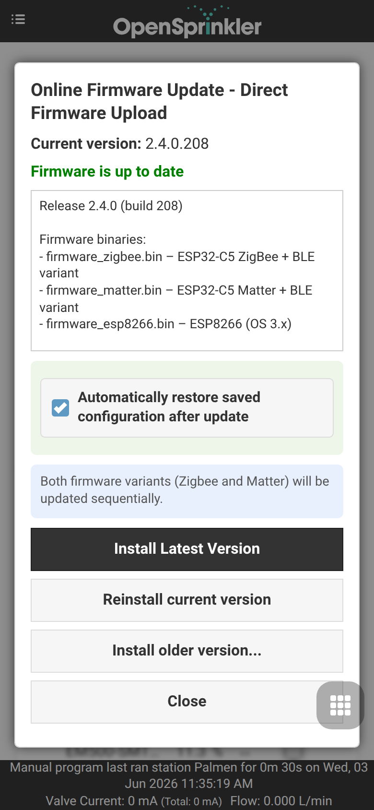{ .mobile-screenshot } |
| Tryb radiowy ESP32-C5 / Matter | Menu boczne → **Setup ESP32 Mode** | 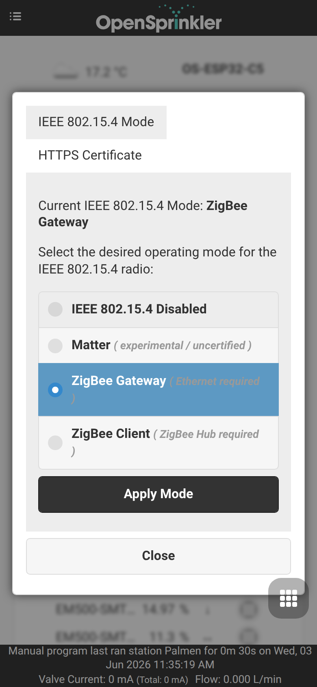{ .mobile-screenshot } |
| Bramka (Gateway) Zigbee | Menu boczne → **ZigBee Gateway** | 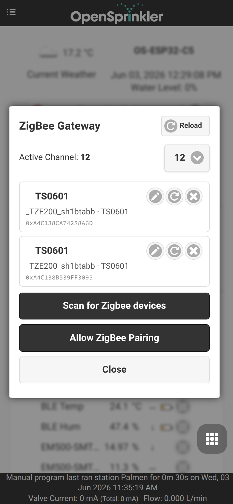{ .mobile-screenshot } |
| Usługa ESP RainMaker | Menu boczne → **RainMaker** | 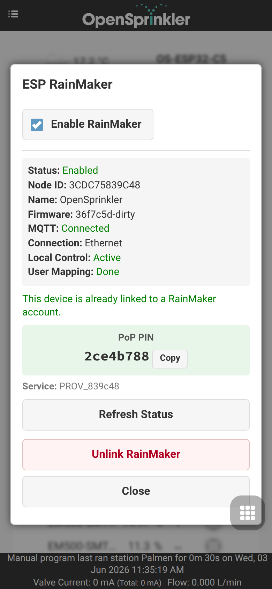{ .mobile-screenshot } |
| MQTT, e-mail, IFTTT i powiadomienia | Menu dolne → **Edit Options** → **Integrations** | { .mobile-screenshot } |
| Konfiguracja czujników, FYTA i alarmów | Menu dolne → **Analog Sensor Configuration** | 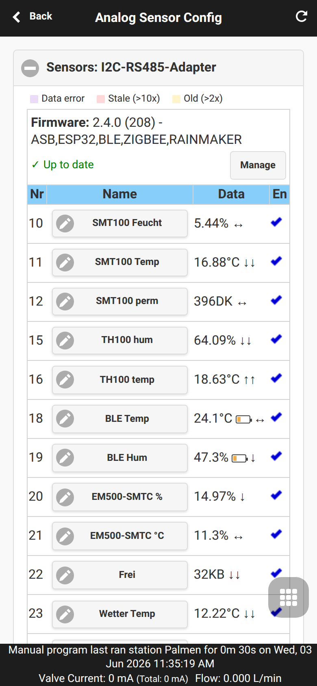{ .mobile-screenshot } |
| Dodaj/Edytuj czujnik | Menu dolne → **Analog Sensor Configuration** → **Add Sensor** | 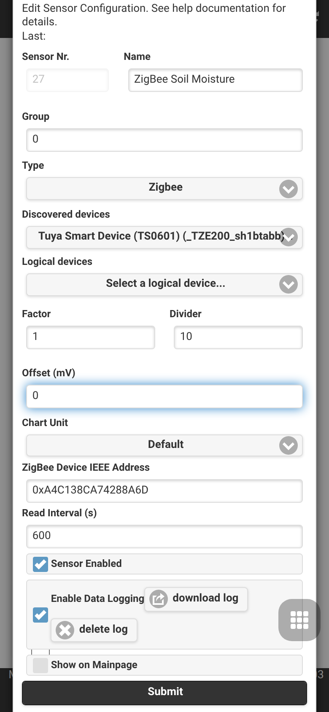{ .mobile-screenshot } |
| Korekty harmonogramów | Menu dolne → **Analog Sensor Configuration** → **Program Adjustments** | 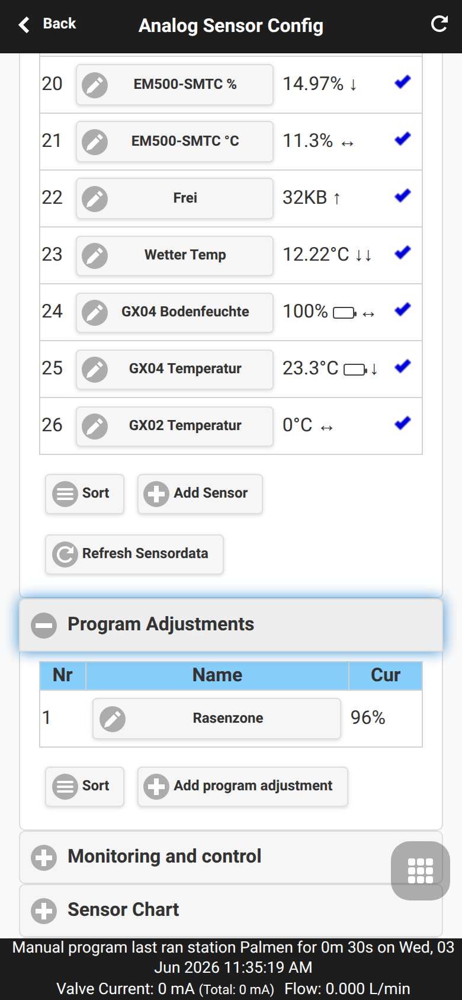{ .mobile-screenshot } |
| Dodaj korektę | Menu dolne → **Analog Sensor Configuration** → **Program Adjustments** → **Add program adjustment** | 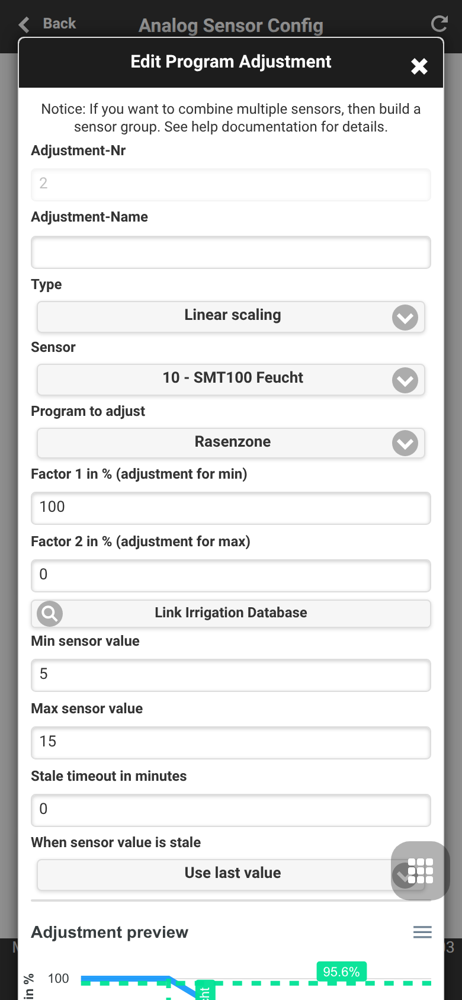{ .mobile-screenshot } |
| Lokalne monitorowanie i reguły | Menu dolne → **Analog Sensor Configuration** → **Monitoring and Control** | 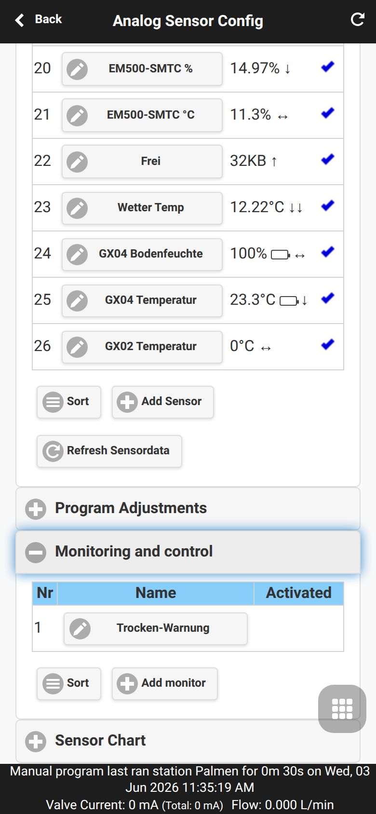{ .mobile-screenshot } |
| Dodaj regułę monitorowania | Menu dolne → **Analog Sensor Configuration** → **Monitoring and Control** → **Add monitor** | { .mobile-screenshot } |
| Wykres pomiarów czujnika | Menu dolne → **Analog Sensor Configuration** → **Sensor Chart** | 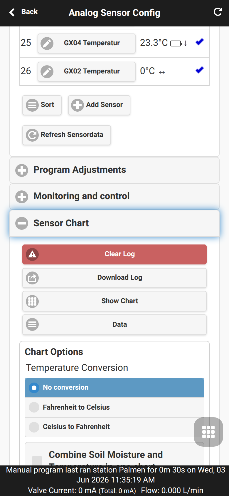{ .mobile-screenshot } |
| Konfiguracja czujników FYTA | Menu dolne → **Analog Sensor Configuration** → **FYTA Setup** | 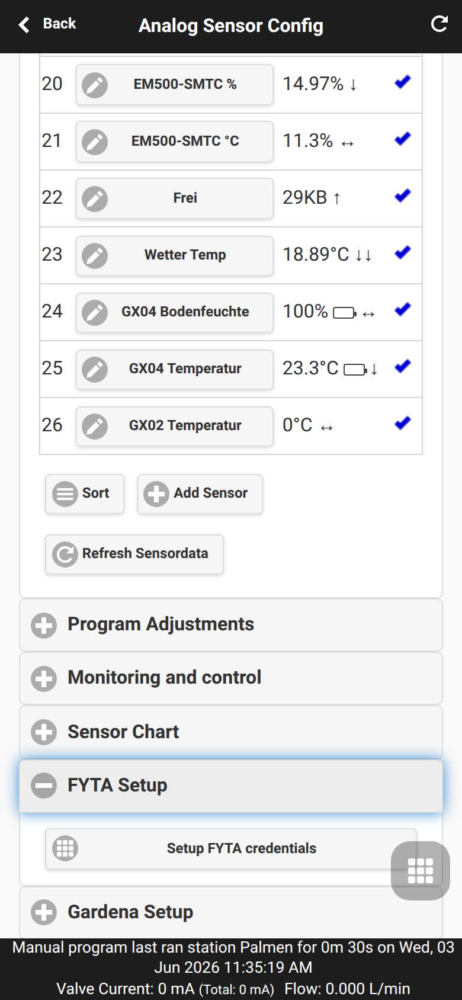{ .mobile-screenshot } |
| Dane logowania FYTA | Menu dolne → **Analog Sensor Configuration** → **FYTA Setup** → **Setup FYTA credentials** | 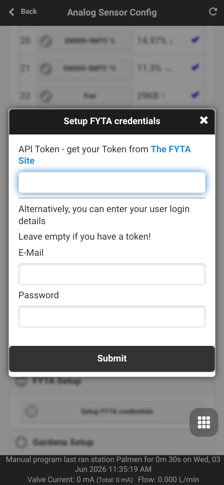{ .mobile-screenshot }|
| Kopia zapasowa czujników | Menu dolne → **Analog Sensor Configuration** → **Backup and Restore** | 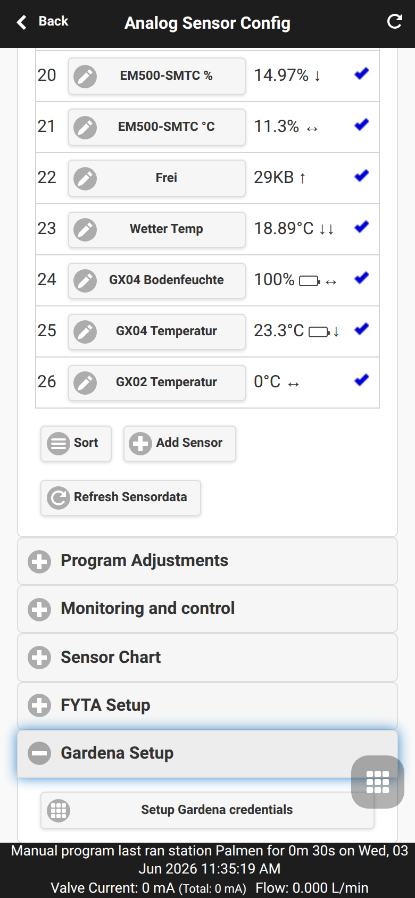{ .mobile-screenshot } |
| Diagnostyka systemowa | Menu boczne → **System Diagnostics** | 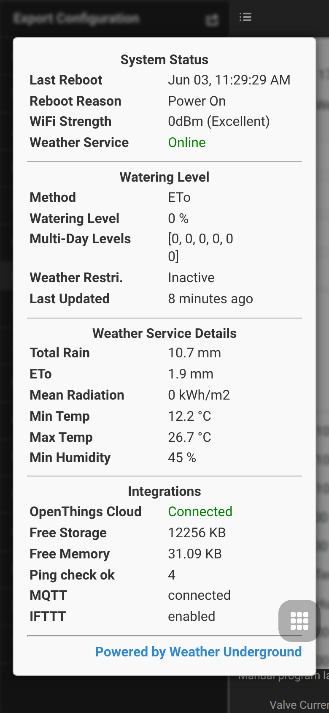{ .mobile-screenshot } |

## Aktualizacje OTA online

Oprogramowanie układowe Pro wprowadza centralne zarządzanie aktualizacjami w chmurze (`online_update.cpp`). Sterownik potrafi samodzielnie odpytać serwer o nowe wersje, dokonać weryfikacji sumy kontrolnej, przeprowadzić kopię bezpieczeństwa przed zapisem oraz sflashować wybrane oprogramowanie.

**Użycie interfejsu (UI):** Otwórz menu boczne, a następnie wybierz pozycję **Online Update**. Jest to najbardziej zalecana metoda aktualizacji oprogramowania, zapobiegająca utracie danych użytkownika.

{ .mobile-screenshot }

Wskazówki systemowe:
- **ESP32 i ESP8266:** Aktualizacje bezprzewodowe OTA są dostępne również z poziomu ręcznego wgrywania plików binarnych.
- **OSPi (Raspberry Pi):** Aktualizacji należy dokonywać bezpośrednio z powłoki systemowej (skrypty terminala / repozytorium Git).
- Połączenie z siecią Internet jest wymagane do pobrania najnowszego manifestu aktualizacji.

Przed aktualizacją zaleca się wyeksportowanie konfiguracji. W systemach ESP32 oraz ESP8266, REST API obsługuje polecenie `/ub` tworzące pełny zrzut zabezpieczający bazy danych, natomiast `/sx` eksportuje wyłącznie wpisy dotyczące czujników.
